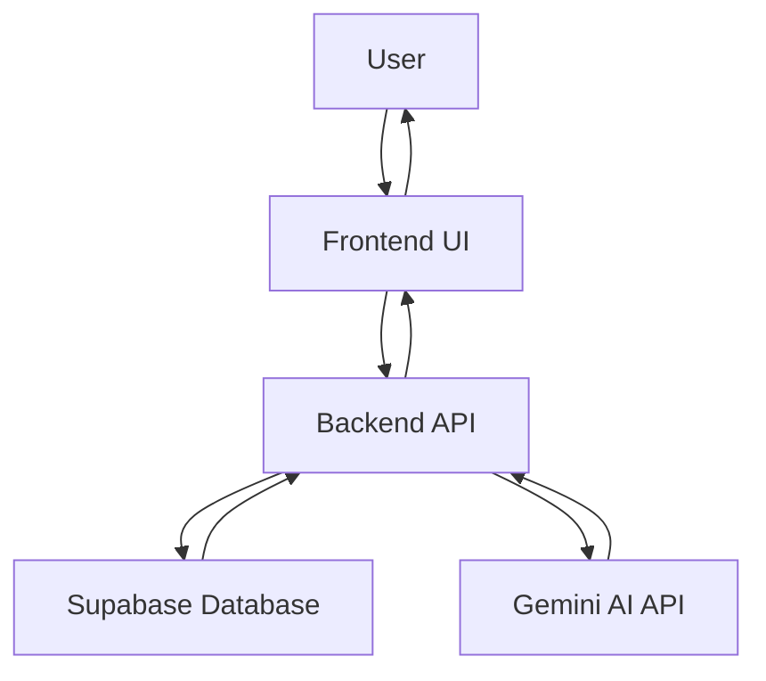

<!-- PROJECT LOGO -->
<br />
<div align="center">
  <a href="https://github.com/yvi-tech-assistant">
    
  </a>

  <h3 align="center">YVI Technologies Assistant</h3>

  <p align="center">
    An intelligent AI-powered chatbot solution for enterprise customer support and knowledge management
    <br />
    <a href="https://github.com/yvitechnologies/yvi-tech-assistant"><strong>Explore the docs »</strong></a>
    <br />
    <br />
    <a href="https://yvichatbot.netlify.app">View Demo</a>
    ·
    <a href="https://github.com/yvitechnologies/yvi-tech-assistant/issues">Report Bug</a>
    ·
    <a href="https://github.com/yvitechnologies/yvi-tech-assistant/issues">Request Feature</a>
  </p>
</div>

<!-- TABLE OF CONTENTS -->
<details>
  <summary>Table of Contents</summary>
  <ol>
    <li>
      <a href="#about-the-project">About The Project</a>
      <ul>
        <li><a href="#key-features">Key Features</a></li>
        <li><a href="#built-with">Built With</a></li>
      </ul>
    </li>
    <li>
      <a href="#getting-started">Getting Started</a>
      <ul>
        <li><a href="#prerequisites">Prerequisites</a></li>
        <li><a href="#installation">Installation</a></li>
      </ul>
    </li>
    <li><a href="#usage">Usage</a></li>
    <li><a href="#architecture">Architecture</a></li>
    <li><a href="#deployment">Deployment</a></li>
    <li><a href="#api-endpoints">API Endpoints</a></li>
    <li><a href="#roadmap">Roadmap</a></li>
    <li><a href="#contributing">Contributing</a></li>
    <li><a href="#license">License</a></li>
    <li><a href="#contact">Contact</a></li>
    <li><a href="#acknowledgments">Acknowledgments</a></li>
  </ol>
</details>

<!-- ABOUT THE PROJECT -->
## About The Project

[![Product Name Screen Shot][product-screenshot]](https://yvichatbot.netlify.app)

The YVI Technologies Assistant is an enterprise-grade AI chatbot solution designed to provide intelligent customer support and knowledge management for businesses. Built with cutting-edge technologies, it combines the power of Google's Gemini AI with a robust knowledge base system to deliver accurate, context-aware responses to user inquiries.

Our solution addresses the common challenge faced by technology companies in providing efficient customer support while maintaining consistency in information delivery. By leveraging hybrid AI architecture, the assistant can access both structured company data and generate human-like responses for complex queries.

### Key Features

* **Hybrid AI Architecture**: Combines database-driven responses with generative AI for comprehensive coverage
* **Knowledge Management**: Centralized knowledge base with Supabase integration for easy content management
* **Multi-language Support**: Internationalization capabilities with support for multiple languages
* **Rich UI Components**: Modern, responsive interface built with React and Shadcn UI components
* **Session Management**: Persistent chat sessions with local storage for seamless user experience
* **Analytics Dashboard**: Built-in analytics for monitoring chat performance and user engagement
* **Favorites System**: Save important responses and organize them by categories and tags
* **Prompt Library**: Predefined prompts for common use cases to accelerate interactions
* **Threading Support**: Create conversation branches for exploring different topics
* **Export Functionality**: Export chat sessions in multiple formats for documentation
* **Admin Dashboard**: Comprehensive admin interface for monitoring and managing the system
* **Responsive Design**: Fully responsive interface that works on desktop, tablet, and mobile devices

### Built With

**Frontend**
* [React](https://reactjs.org/) - JavaScript library for building user interfaces
* [TypeScript](https://www.typescriptlang.org/) - Typed superset of JavaScript
* [Vite](https://vitejs.dev/) - Next generation frontend tooling
* [Tailwind CSS](https://tailwindcss.com/) - Utility-first CSS framework
* [Shadcn UI](https://ui.shadcn.com/) - Re-usable components built with Radix UI and Tailwind CSS
* [React Query](https://tanstack.com/query/latest) - Data fetching and state management
* [React Router](https://reactrouter.com/) - Declarative routing for React
* [I18next](https://www.i18next.com/) - Internationalization framework

**Backend**
* [Flask](https://flask.palletsprojects.com/) - Lightweight WSGI web application framework
* [Python](https://www.python.org/) - High-level programming language
* [Supabase](https://supabase.com/) - Open source Firebase alternative
* [Gemini AI](https://ai.google.dev/) - Google's generative AI model
* [Gunicorn](https://gunicorn.org/) - Python WSGI HTTP Server

**Deployment**
* [Netlify](https://www.netlify.com/) - Frontend hosting platform
* [Render](https://render.com/) - Cloud application hosting platform

<!-- GETTING STARTED -->
## Getting Started

To get a local copy up and running, follow these simple steps.

### Prerequisites

Ensure you have the following installed on your system:
* Python 3.9 or higher
* Node.js 16 or higher
* npm (comes with Node.js)
* A Supabase account
* A Google AI Studio account for Gemini API access

### Installation

1. Clone the repo
   ```sh
   git clone https://github.com/yvitechnologies/yvi-tech-assistant.git
   cd yvi-tech-assistant
   ```

2. Set up the backend
   ```sh
   cd backend
   python -m venv venv
   # On Windows
   venv\Scripts\activate
   # On macOS/Linux
   source venv/bin/activate
   pip install -r requirements.txt
   ```

3. Configure backend environment variables
   Create a `.env` file in the `backend` directory:
   ```env
   SUPABASE_URL=your_supabase_project_url
   SUPABASE_KEY=your_supabase_anon_key
   GEMINI_API_KEY=your_gemini_api_key
   FLASK_ENV=development
   FRONTEND_URL=http://localhost:3000
   ```

4. Set up the frontend
   ```sh
   cd ../frontend
   npm install
   ```

5. Configure frontend environment variables
   Create a `.env` file in the `frontend` directory:
   ```env
   VITE_BACKEND_URL=http://localhost:5000
   ```

<!-- USAGE EXAMPLES -->
## Usage

1. Start the backend server
   ```sh
   cd backend
   python app.py
   ```
   The backend will be available at `http://localhost:5000`

2. Start the frontend development server
   ```sh
   cd frontend
   npm run dev
   ```
   The frontend will be available at `http://localhost:3000`

3. Open your browser and navigate to `http://localhost:3000`

4. Start chatting with the YVI Technologies Assistant!

_For more examples, please refer to the [Documentation](https://github.com/yvitechnologies/yvi-tech-assistant/wiki)_

<!-- ARCHITECTURE -->
## Architecture

The YVI Technologies Assistant follows a modern microservices architecture with a clear separation between frontend and backend components.

### System Components

1. **Frontend (React + TypeScript)**
   - User interface for chat interactions
   - State management with React Query
   - Component library with Shadcn UI
   - Responsive design with Tailwind CSS

2. **Backend (Flask + Python)**
   - RESTful API endpoints
   - Hybrid AI response system
   - Supabase integration for data storage
   - Gemini AI integration for generative responses

3. **Data Layer (Supabase)**
   - Knowledge base storage
   - Chat session management
   - User interaction logging
   - Analytics data storage

4. **AI Layer (Gemini AI)**
   - Natural language processing
   - Context-aware response generation
   - Fallback response mechanism

### Data Flow



### Hybrid Response System

The assistant uses a hybrid approach to generate responses:

1. **Database Lookup**: First, it searches the Supabase knowledge base for exact or similar matches
2. **AI Enhancement**: If a match is found, it uses Gemini AI to enrich and contextualize the response
3. **AI Generation**: If no match is found, it generates a response entirely with Gemini AI
4. **Fallback**: In case of AI failures, appropriate error messages are displayed

<!-- DEPLOYMENT -->
## Deployment

The application is configured for deployment on Netlify (frontend) and Render (backend).

### Frontend Deployment (Netlify)

1. Build the frontend:
   ```sh
   cd frontend
   npm run build
   ```

2. Deploy using one of these methods:
   * **Git-based deployment**: Connect your repository to Netlify
   * **Manual deployment**: Drag and drop the `dist` folder to Netlify

3. Set environment variables in Netlify:
   * `VITE_BACKEND_URL`: Your deployed backend URL

### Backend Deployment (Render)

1. Push your code to a Git repository

2. Connect Render to your repository

3. Configure the web service with these settings:
   * Build command: `pip install -r backend/requirements.txt`
   * Start command: `gunicorn --bind 0.0.0.0:$PORT backend.app:app`

4. Set environment variables in Render:
   * `SUPABASE_URL`: Your Supabase project URL
   * `SUPABASE_KEY`: Your Supabase service key
   * `GEMINI_API_KEY`: Your Gemini API key
   * `FRONTEND_URL`: Your deployed frontend URL
   * `FLASK_ENV`: production

### Post-Deployment Configuration

1. Update CORS settings in the backend to allow your frontend domain
2. Verify all environment variables are correctly set
3. Test the connection between frontend and backend
4. Monitor logs for any deployment issues

<!-- API ENDPOINTS -->
## API Endpoints

### Chat Endpoints

| Endpoint | Method | Description |
|----------|--------|-------------|
| `/chat` | POST | Process user messages and generate AI responses |
| `/api/chat-sessions/<session_id>` | DELETE | Delete a specific chat session |

### Admin Endpoints

| Endpoint | Method | Description |
|----------|--------|-------------|
| `/admin` | GET | Admin dashboard interface |
| `/api/stats` | GET | Retrieve system statistics |
| `/api/logs` | GET | Retrieve chat interaction logs |

### Frontend Serving Endpoints

| Endpoint | Method | Description |
|----------|--------|-------------|
| `/` | GET | Serve the main frontend application |
| `/<path:path>` | GET | Serve static assets and handle client-side routing |

<!-- ROADMAP -->
## Roadmap

- [ ] Multi-user authentication system
- [ ] Advanced analytics with data visualization
- [ ] Customizable AI response tone and personality
- [ ] Integration with additional AI models
- [ ] Voice input and output capabilities
- [ ] Mobile application development
- [ ] Advanced prompt engineering tools
- [ ] Knowledge base management UI
- [ ] Enterprise SSO integration
- [ ] API rate limiting and security enhancements

See the [open issues](https://github.com/yvitechnologies/yvi-tech-assistant/issues) for a full list of proposed features (and known issues).

<!-- CONTRIBUTING -->
## Contributing

Contributions are what make the open source community such an amazing place to learn, inspire, and create. Any contributions you make are **greatly appreciated**.

If you have a suggestion that would make this better, please fork the repo and create a pull request. You can also simply open an issue with the tag "enhancement".

1. Fork the Project
2. Create your Feature Branch (`git checkout -b feature/AmazingFeature`)
3. Commit your Changes (`git commit -m 'Add some AmazingFeature'`)
4. Push to the Branch (`git push origin feature/AmazingFeature`)
5. Open a Pull Request

### Development Guidelines

1. Follow the existing code style and conventions
2. Write clear, descriptive commit messages
3. Include appropriate tests for new features
4. Update documentation when making changes
5. Ensure all tests pass before submitting a pull request

<!-- LICENSE -->
## License

Distributed under the MIT License. See `LICENSE` for more information.

<!-- CONTACT -->
## Contact

YVI Technologies - [@yvitechnologies](https://twitter.com/yvitechnologies) - contact@yvitechnologies.com

Project Link: [https://github.com/yvitechnologies/yvi-tech-assistant](https://github.com/yvitechnologies/yvi-tech-assistant)

<!-- ACKNOWLEDGMENTS -->
## Acknowledgments

* [Google AI](https://ai.google.dev/) for providing the Gemini API
* [Supabase](https://supabase.com/) for the excellent backend-as-a-service platform
* [Shadcn UI](https://ui.shadcn.com/) for the beautiful UI components
* [Netlify](https://www.netlify.com/) for seamless deployment
* [Render](https://render.com/) for reliable backend hosting
* [Img Shields](https://shields.io/) for the awesome README badges

<!-- MARKDOWN LINKS & IMAGES -->
<!-- [contributors-shield]: https://img.shields.io/github/contributors/yvitechnologies/yvi-tech-assistant.svg?style=for-the-badge
[contributors-url]: https://github.com/yvitechnologies/yvi-tech-assistant/graphs/contributors
[forks-shield]: https://img.shields.io/github/forks/yvitechnologies/yvi-tech-assistant.svg?style=for-the-badge
[forks-url]: https://github.com/yvitechnologies/yvi-tech-assistant/network/members
[stars-shield]: https://img.shields.io/github/stars/yvitechnologies/yvi-tech-assistant.svg?style=for-the-badge
[stars-url]: https://github.com/yvitechnologies/yvi-tech-assistant/stargazers
[issues-shield]: https://img.shields.io/github/issues/yvitechnologies/yvi-tech-assistant.svg?style=for-the-badge
[issues-url]: https://github.com/yvitechnologies/yvi-tech-assistant/issues
[license-shield]: https://img.shields.io/github/license/yvitechnologies/yvi-tech-assistant.svg?style=for-the-badge
[license-url]: https://github.com/yvitechnologies/yvi-tech-assistant/blob/master/LICENSE.txt
[product-screenshot]: images/screenshot.png -->
